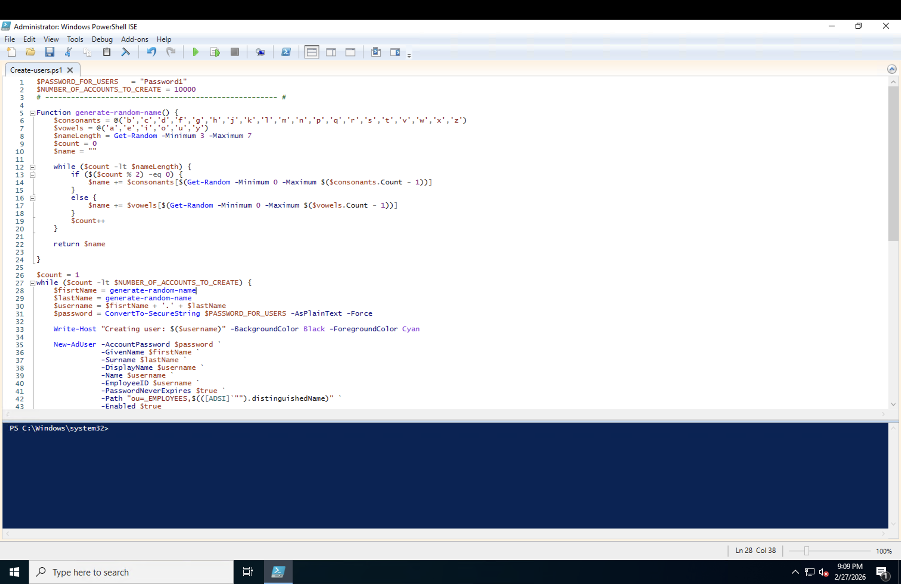
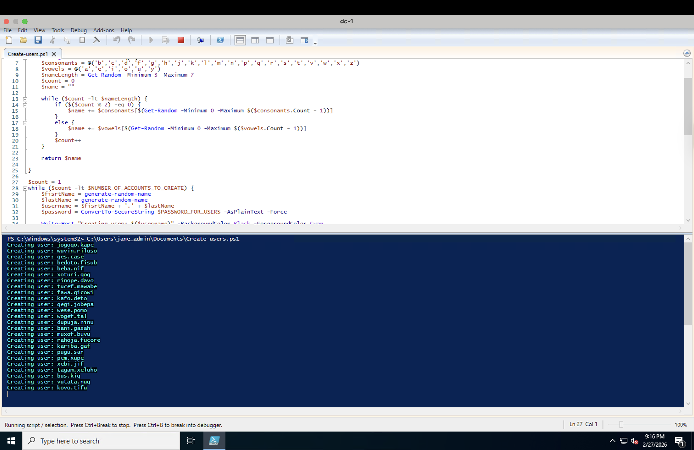
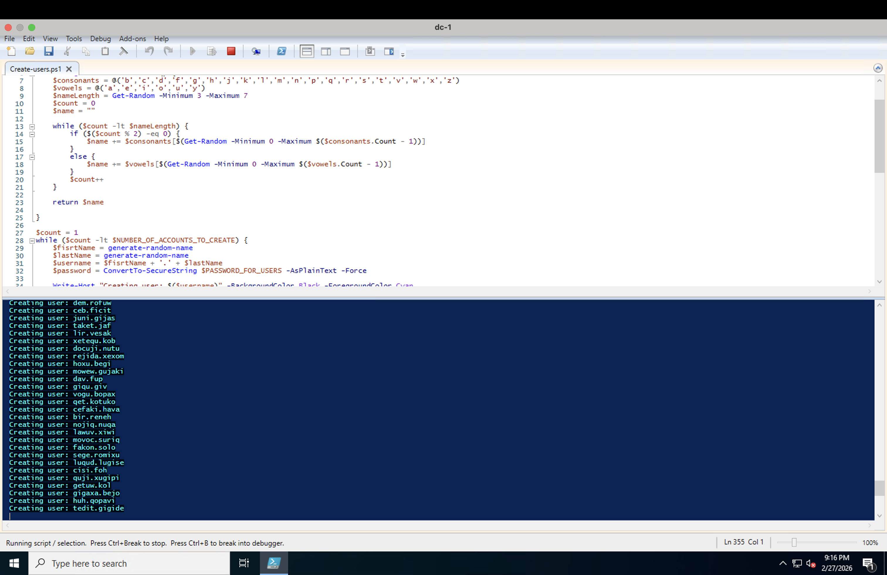
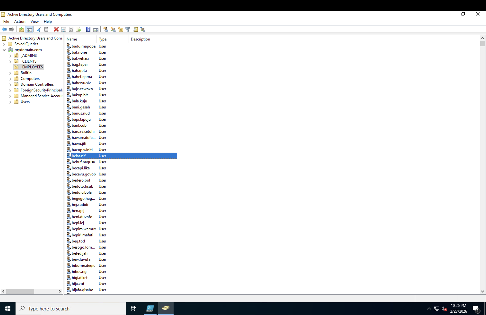
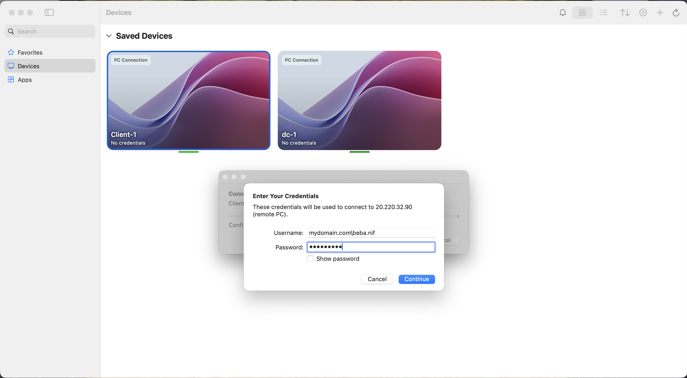

<h1>Automating Active Directory User Creation with PowerShell</h1>
In this section of the lab, Windows PowerShell ISE was used to automate the creation of large numbers of Active Directory user accounts. Instead of manually creating each user one at a time in Active Directory Users and Computers, a script was used to generate usernames, assign passwords, and place the accounts into the _EMPLOYEES Organizational Unit. 

<h2>Environments and Technologies Used</h2>

- Microsoft Azure (Virtual Machines)
- Active Directory Domain Services (AD DS)
- Active Directory Users and Computers (ADUC)
- Windows PowerShell ISE
- Active Directory PowerShell Module
- Remote Desktop Protocol (RDP)
  
<h2>Operating Systems Used </h2>

- Windows Server 2022 (Domain Controller: DC-1)
- Windows 11 (Client Machine: Client-1)

<h2>Open and Review the PowerShell User Creation Script</h2>

Step-by-step

1. Open Windows PowerShell ISE as Administrator.
2. Load the user creation script into the editor pane.
3. Review the variables and configuration settings in the script.
4. Confirm the password value assigned to generated accounts.
5. Confirm the number of users the script is set to create.
6. Review the script structure before execution.

Explanation: 
 This step represents the preparation stage of the automation process. Reviewing the script ensures that account settings, naming structure, and configuration values are correct before creating users in Active Directory.

<h2>Review the New-ADUser Automation Logic</h2>

Step-by-step
  
1. Review the section of the script responsible for account creation.
2. Confirm a loop is used to generate multiple users.
3. Verify that first and last names are automatically generated.
4. Confirm the names are combined into a username format.
5. Review how the password is converted into a secure string.
6. Confirm the New-ADUser cmdlet is used to create each account.
7. Verify the Path parameter points to the _EMPLOYEES Organizational Unit.
8. Confirm the accounts are created as enabled.

Explanation:
 This step highlights the core automation logic. PowerShell replaces manual account creation by generating users programmatically, demonstrating how administrators efficiently manage large environments using scripting.

<h2>Execute the Script and Create User Accounts</h2>

Step-by-step

1. Click Run Script in Windows PowerShell ISE.
2. Monitor the console output in the lower pane.
3. Confirm output lines such as Creating user: appear.
4. Verify that usernames are generated continuously.
5. Allow the script to complete the user creation process.

Explanation:
 This step confirms that the script executes successfully. The live output provides proof that user accounts are being created in real time through automation.

<h2>Verify Accounts in Active Directory Users and Computers</h2>

Step-by-step

1. Open **Active Directory Users and Computers**.
2. Expand the domain on the left pane.
3. Locate and Select the **_EMPLOYEES Organizational Unit**.
4. Review the list of users displayed.
5. Select a user account that will be used for attempt log-in.

Explanation:
  This step verifies that the script successfully creates user accounts and places them in the correct Organizational Unit. It confirms that the automation process writes data into Active Directory as expected.

<h2>Attempt Sign-In with a Generated User Account</h2>

Step-by-step

1. Access the client machine.
2. Enter the username of the generated account.
3. Input the password defined in the script.
4. Begin the sign-in process using the domain account.

Explanation:
 This step tests authentication using a newly created account. It verifies that the account credentials are recognized by Active Directory and that the login process initiates successfully.

<h2>Confirm Successful Login with the Generated User</h2>

Step-by-step

1. Allow the login process to complete.
2. Confirm the user profile begins loading.
3. Verify access to the client machine under the generated account.

Explanation:
 This is the final validation step. It confirms that the PowerShell-created accounts are fully functional and can successfully authenticate and access systems within the domain environment.

<h2>Conculsion</h2>

This phase of the lab used Windows PowerShell ISE to automate the creation of domain user accounts in Active Directory. A script was configured with a default password, a target number of accounts, and the New-ADUser cmdlet to create users inside the _EMPLOYEES Organizational Unit. After execution, the accounts appeared in Active Directory Users and Computers, their group membership was verified, and a generated user successfully logged into the client machine.
